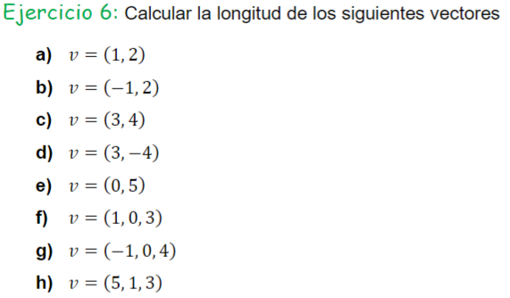

- Unidad 1
  - [Ejercicio 1](#ejercicio-1)
  - [Ejercicio 2](#ejercicio-2)
  - [Ejercicio 3](#ejercicio-3)
  - [Ejercicio 4](#ejercicio-4)
  - [Ejercicio 5](#ejercicio-5)
  - [Ejercicio 6](#ejercicio-6)
  - [Ejercicio 7](#ejercicio-7)
  - [Ejercicio 8](#ejercicio-8)
  - [Ejercicio 9](#ejercicio-9)
  - [Ejercicio 10](#ejercicio-10)
  - [Ejercicio 11](#ejercicio-11)
  - [Ejercicio 12](#ejercicio-12)
  - [Ejercicio 14, 15 y 16](#ejercicio-14,-15-y-16)
  - [Ejercicio 17](#ejercicio-17)
  - [Ejercicio 18](#ejercicio-18)
  - [Ejercicio 20](#ejercicio-20)
  - [Ejercicio 21](#ejercicio-21)
  - [Ejercicio 22](#ejercicio-22)
  - [Ejercicio 23](#ejercicio-23)
  - [Ejercicio 25](#ejercicio-25)

# Ejercicio 1:

# Ejercicio 2

# Ejercicio 3

 
# Ejercicio 4
 

# Ejercicio 5

![[Pasted image 20240502105604.png]]

# Ejercicio-6

# Ejercicio-7

# Ejercicio-8

# Ejercicio-9

# Ejercicio-10

# Ejercicio-11

# Ejercicio-12

# Ejercicio-14,-15-y-16

# Ejercicio-17

# Ejercicio-18

# Ejercicio-20

# Ejercicio-21

# Ejercicio-22
 

# Ejercicio-23
 

# Ejercicio-25

[Siguiente Practica](.) >>
